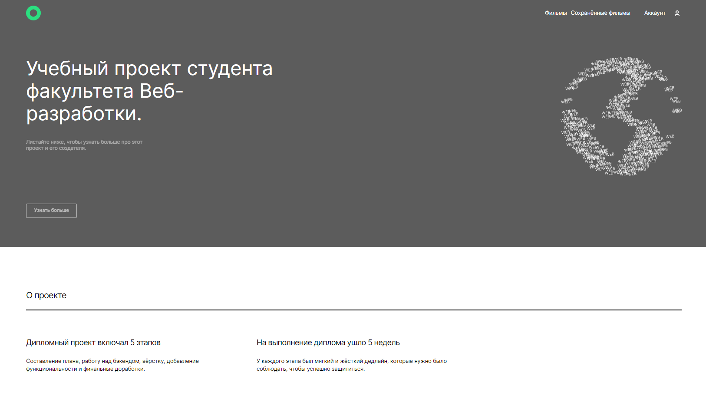
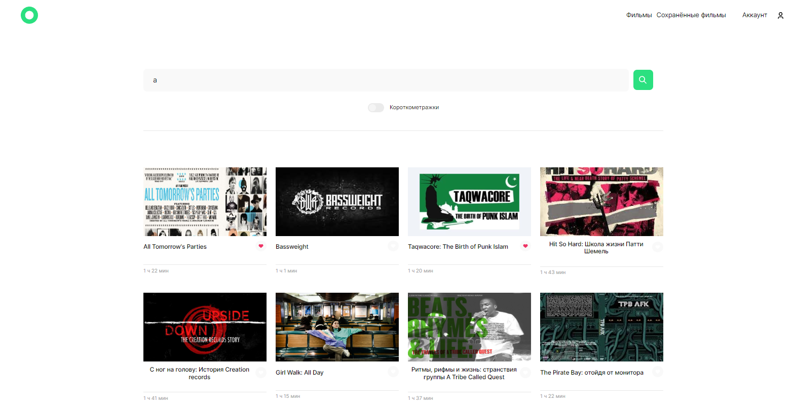
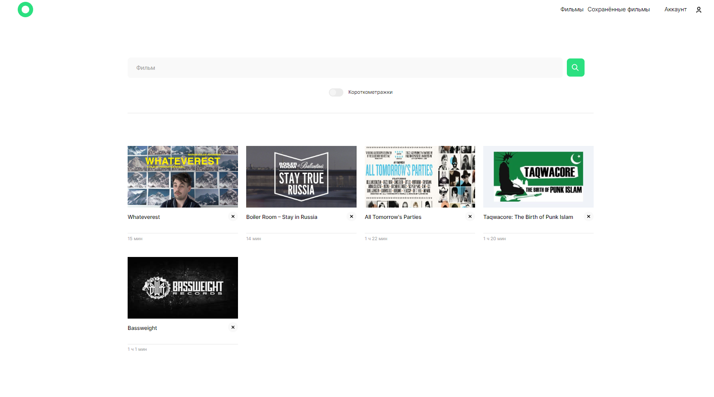

# MOVIES-EXPLORER-FRONTEND

ссылка https://ave-emperror.nomoredomains.work/main
(скоро кончается грант на облако, может перестать работать)

## Функциональность

Сайт с фильмами. Аутентификация/авторизация. 
Запросы к api. Фильрация данных на стороне пользователя. 
Возможность поиска фильмов и простановки лайков. 
Сохранение понравившихся фильмов 
Адаптивная верстка 

### Главная страница

### Страница с фильмыми

### Страница с сохраненными фильмыми

### Страница с аккаунтом

### Стек:

- HTML
- CSS
- JavaScript
- React

### Запуск проекта

Для запуска проекта:

1. Клонировать репозиторий git clone https://github.com/Firebird234/movies-explorer-frontend.git.
2. Установить все зависимости npm install.
3. Запустить проект npm start.
   [https://ave-emperror.nomoredomains.work/main]
